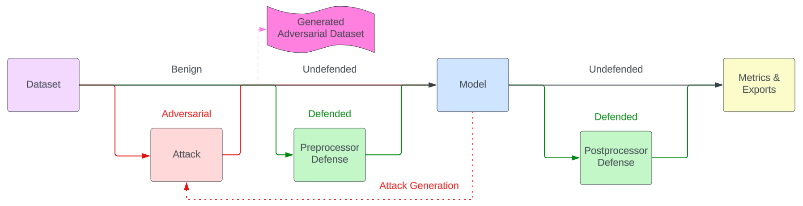

---

[![CI][ci-badge]][ci-url]
[![PyPI Status Badge][pypi-badge]][pypi-url]
[![PyPI - Python Version][python-badge]][python-url]
[![License: MIT][license-badge]][license-url]
[![Docs][docs-badge]][docs-url]
[![Code style: black][style-badge]][style-url]
[](https://zenodo.org/doi/10.5281/zenodo.10041829)

- [Overview](#overview)
    - [History](#history)
        - [What is Adversarial AI?](#what-is-adversarial-ai)
        - [Broader Impact](#broader-impact)
    - [How It Works](#how-it-works)
        - [Data Ingestion and Model Loading](#data-ingestion-and-model-loading)
        - [Adversarial Attack Integration](#adversarial-attack-integration)
        - [Defensive Techniques](#defensive-techniques)
        - [Pipeline Orchestration and Evaluation](#pipeline-orchestration-and-evaluation)
        - [Visualization and Exporting Results](#visualization-and-exporting-results)
- [Installation & Configuration](#installation--configuration)
    - [Examples](#examples)
- [Quick Look](#quick-look)
- [Documentation](#documentation)
- [The historic GARD-Armory repository](#the-historic-gard-armory-repository)
- [Acknowledgment](#acknowledgment)

# Overview

Armory is a comprehensive platform for evaluating the robustness of machine learning models against adversarial attacks. It is a pure Python library built on top of existing libraries such as PyTorch, Hugging Face, and IBM's Adversarial Robustness Toolbox (ART). The primary focus of Armory is to help machine learning engineers understand how models behave under various adversarial conditions and how defenses may mitigate these attacks. 

## History

Armory was developed as part of the [Guaranteeing AI Robustness against Deception (GARD) program][gardproject] under the Defense Advanced Research Projects Agency (DARPA). The GARD program's mission was to establish theoretical foundations for machine learning system vulnerabilities, to characterize properties that will enhance system robustness, and to advance the creation of effective defenses.

### What is Adversarial AI?

Adversarial AI refers to the manipulation of AI models through carefully crafted inputs designed to exploit vulnerabilities in machine learning algorithms. These inputs are often imperceptible to humans but can cause AI systems to make incorrect decisions, such as misclassifying images or generating incorrect text. For instance, an adversarial attack might slightly alter an image of a stop sign, leading a self-driving car to misinterpret it as a yield sign with potentially catastrophic consequences.

There are various types of adversarial attacks:

- Evasion attacks: Introduce small perturbations to inputs during model inference to trick the model into making incorrect predictions.
- Poisoning attacks: Manipulate training data to compromise the model during its learning phase.
- Model extraction: Recreate a machine learning model by exploiting access to the model's outputs.
- Model inversion: Reverse-engineer sensitive information about the data used to train a model.
- Model membership: Determine whether a specific data point was used to train the model.

The GARD program was established to tackle these threats by developing defensive techniques that make AI systems more robust and resilient to adversarial manipulations. The program brought together industry experts, including Two Six Technologies, IBM and MITRE, along with researchers from academic institutions to explore the limits of adversarial attacks and develop cutting-edge defenses.

### Broader Impact

While the GARD program focused on government and military use cases, the potential for adversarial attacks extends to numerous domains, including healthcare, autonomous vehicles, finance, and cybersecurity. Armory is an open-source tool available to the wider AI community, helping researchers and engineers evaluate the robustness of their models across industries. The goal of Armory is to ensure that AI systems used in applications from medical diagnosis to autonomous drones can remain secure and effective even under adversarial conditions.

## How It Works

Armory provides a comprehensive platform to evaluate the robustness of AI models against adversarial attacks. It integrates several key features into user-defined pipelines that allow machine learning engineers to conduct robust model evaluations, implement novel attacks and defenses, and visualize results.



#### Data Ingestion and Model Loading

- Armory supports various datasets, including those from Hugging Face and TorchVision (e.g., ImageNet, COCO). Users can load datasets for tasks such as image classification and object detection.

- Armory works with a wide range of machine learning models from libraries like PyTorch and Hugging Face Transformers. These models are wrapped into Armory’s API for easy integration into the evaluation pipeline.

#### Adversarial Attack Integration

- Armory currently specializes in evasion attacks. Other attack types like poisoning attacks (which compromise model training) and model inversion (which infers training data) are also planned for future releases.

- Attacks are implemented using the Adversarial Robustness Toolbox (ART), which provides standard attacks like Projected Gradient Descent (PGD). Users can also implement custom attacks by following Armory’s API.

#### Defensive Techniques

- Armory includes defenses that can be applied either before or after model predictions. These defenses aim to reduce the impact of adversarial attacks. For instance, the JPEG compression/decompression pre-processing defense filters out adversarial artifacts by removing high-frequency noise from images. Post-processor defenses may seek to rectify model outputs in the presence of adversarial inputs.

- Users can configure both pre-processing defenses (applied before model inference) and post-processing defenses (applied after model predictions) within the evaluation pipeline.

#### Pipeline Orchestration and Evaluation

- The pipeline runs models through a series of stages: benign evaluation (evaluating the model on normal data), adversarial evaluation (evaluating the model on perturbed data), and defense evaluation (applying defenses and re-evaluating the model).

- Metrics like accuracy, precision, recall, and mean average precision (mAP) are calculated for each stage, allowing users to compare the performance of models across different conditions.

#### Visualization and Exporting Results

- Armory provides tools to visualize results, such as confusion matrices and saliency maps, which help interpret how adversarial attacks affect model performance. These visualizations make it easier to understand where the model fails and how effective the defenses are.

- The platform also exports evaluation results (e.g., adversarial examples, metrics) in a format that can be easily analyzed or imported into other tools such as Jupyter notebooks for further exploration.

# Installation & Configuration

```bash
pip install armory-library
```

This is all that is needed to get a working Armory installation. However, Armory-library
is a library and does not contain any sample code. We provide examples in the
`armory-examples` repository which is released concurrently with Armory-library.

## Examples

The `armory-examples` repository includes Jupyter notebooks with examples of:

- Setting up data pipelines
- Running adversarial attacks
- Implementing defenses
- Visualizing results

To install the examples, run:

```bash
pip install armory-examples
```

The [example source code][example-src], along with the [Armory-library
documentation](docs/index.md) and [API Documentation][docs-rtd] is a good place to learn how to construct your own
evaluations using Armory.

# Quick Look

We have provided an sample notebook that uses Armory to evaluate a food101 classifier
in the presence of a Project Gradient Descent (PGD) attack. The notebook can be run for free
on Google Colab to get a preview of how Armory works.

[![Open In Colab][colab-badge]][colab-url]

# Documentation

The Armory-library documentation is [published on GitHub][docs-url] or
can be viewed directly in [the docs directory](docs/index.md) of this repository.
The development team for Armory-library can be reached at <armory@twosixtech.com>.


# The historic GARD-Armory repository

Armory-library is the successor to the [GARD-Armory research program run under
DARPA][GARD-Armory]. As that program has reached its conclusion, the GARD-Armory
repository has been archived sometime in 2024 and there will be no further developmen.

# Acknowledgment

This material is based upon work supported by the Defense Advanced Research Projects
Agency (DARPA) under Contract No. HR001120C0114 and US Army (JATIC) Contract No.
W519TC2392035. Any opinions, findings and conclusions or recommendations expressed in
this material are those of the author(s) and do not necessarily reflect the views of the
DARPA or JATIC.


<!-- https://www.markdownguide.org/basic-syntax/#reference-style-links -->
[ci-badge]: https://github.com/twosixlabs/armory-library/actions/workflows/ci.yml/badge.svg
[ci-url]: https://github.com/twosixlabs/armory-library/actions/
[pypi-badge]: https://badge.fury.io/py/armory-library.svg
[pypi-url]: https://pypi.org/project/armory-library
[python-badge]: https://img.shields.io/pypi/pyversions/armory-library
[python-url]: https://pypi.org/project/armory-library
[license-badge]: https://img.shields.io/badge/License-MIT-yellow.svg
[license-url]: https://opensource.org/licenses/MIT
[docs-badge]: https://readthedocs.org/projects/armory/badge/
[docs-rtd]: https://armory-library.readthedocs.io/en/latest/
[docs-url]: https://twosixlabs.github.io/armory-library/
[style-badge]: https://img.shields.io/badge/code%20style-black-000000.svg
[style-url]: https://github.com/psf/black
[gardproject]: https://www.gardproject.org
[colab-badge]: https://colab.research.google.com/assets/colab-badge.svg
[colab-url]: https://colab.research.google.com/github/twosixlabs/armory-library/blob/master/examples/notebooks/image_classification_food101.ipynb
[example-src]: https://github.com/twosixlabs/armory-library/tree/master/examples/src/armory/examples
[GARD-Armory]: https://github.com/twosixlabs/armory
