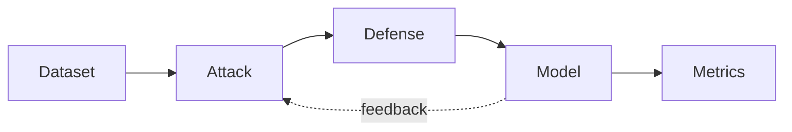
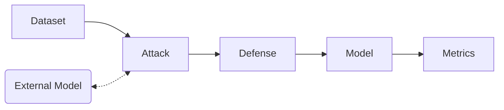

# Implausible Feedback Path Informs Attack in Armory

There is a leak of information from a preprocessor defense to the attack
in the ART Estimator model that gives the attack unfair advantage when
the same model is used for attack generation and defense evaluation.

We typically show the attack evaluation pipeline with a `feedback` edge
from the Model to the Attack which shows the path by which the attack
obtains information from the Model:

When a defense is employed, the attack has a visibility of the defense
which is implausible for an external adversary. The attack metrics are
therefore better in this case than they could be in a real attack.

A more plausible attack pipeline is shown below:

Where the external model is simply another instance of the Model, but crucially
denied the feedback edge which propagates the defense information to the attack.

Evaluation of the two pipelines shows how well the feedback path leaks to the
attack:

|  case |  accuracy |
|---|---|
| benign  |   0.975 |
| defended  | 0.889  |
| undefended |  0.025 |
