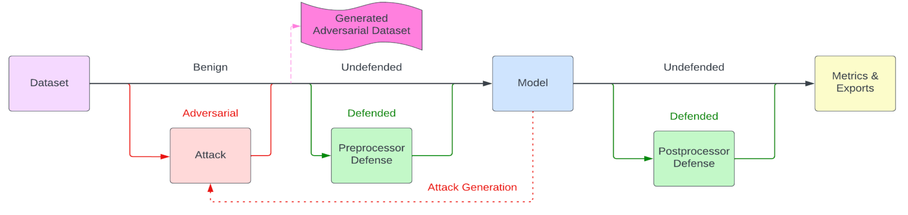

# Getting Started

This tutorial will walk you through the pieces needed to build and execute an
Armory evaluation. In the process, we'll look at the basic concepts of adversarial
evaluation and how Armory provides components needed to effect them.

The basic dataflow of Armory-library is shown in this diagram:



Where the Model and Dataset are the inputs under ev_luation and the Attack is an
adversarial perturbation applied to the Dataset. Typically, the Model and
Dataset will be provided by the armory-library user and the Attack will be drawn
from armory-library or the IBM Adversarial Robustness Toolbox (ART).
In this tutorial we will not deal with the green defense boxes or the
pink generated adversarial dataset box.

## Dataset

Armory currently supports image classification and object detection models.
We look at an image classification example here, with object detection described
in [Diving Deeper](./diving_deeper.ipynb).

The structure of an image classification dataset is simple, consisting of pairs
of images and labels. Images are 2-dimensional arrays of pixels and will often
come as PNG or JPEG images. Labels are integers that correspond to the class of
the image. For example, in the standard MNIST dataset, the images are 28×28 grayscale
handwritten digits and the labels are integers from 0 to 9. The label represent
the "ground truth" for the image, or what the model should predict when shown the
image. Again using MNIST digits, the label associated with a handwritten digit 8
will be 8; we expect the model to predict the label 8 when shown the image.


A dataset is a collection of images (samples) in a sequence-like structure such
as a tuple, map, or numpy array. Each can have a target (label) assigned.
Datasets can be imported from a variety of sources such as PyTorch, Hugging
Face, or GitHub.

#### Basic

The following is a basic example of loading tuple data:

```python
from pprint import pprint

raw_dataset = [
        ([1, 2, 3], 4),
        ([5, 6, 7], 8),
    ]

keyed_dataset = TupleDataset(raw_dataset, x_key="data", y_key="target")
pprint(keyed_dataset)
```

You'll see that we have turned the raw dataset into a map with keys "data" and
"target". These keys are arbitrary; the same ones just need to be provided in
the evaluation later and correspond to the images and labels respectively.

For this dataset we need a adapter because ????.

```python
def adapter(data):
    # ??? What goes here?
dataset = ArmoryDataset(keyed_dataset, adapter)
```

#### Hugging Face

The following is an example of how to load a dataset from [Hugging Face][huggingface]:

```python
import datasets # Hugging Face dataset library
from transformers import AutoImageProcessor # Hugging Face image processor class
from armory.data import ArmoryLoader


dataset = datasets.load_dataset("mnist", split="test")
processor = AutoImageProcessor.from_pretrained(
        "farleyknight-org-username/vit-base-mnist"  # Hugging Face model card
    )

dataset.set_transform(functools.partial(transform, processor))
dataloader = ArmoryDataLoader(dataset, batch_size=batch_size, num_workers=5)
```

The `load_dataset` functions imports the [MNIST][mnist] (handwritten digit)
dataset from Hugging Face. It is the same dataset that was used to train the
model in this example. The `split` parameter specifies which subset of the
dataset to load, is usually either `train` or `test` or possibly `validation`,
depending on the dataset.

The function `transform` then cycles through the dataset and converts each image
into Hugging Face's 'RGB' form. The `set_transform` method is used the the
Hugging Face dataset and applied the transform function to the entire Hugging
Face dataset.

`AutoImageProcessor.from_pretrained` expects a Hugging Face name for the model
card. Then the PyTorch `ArmoryDataLoader` generates the numpy arrays that are
required by ART for the evaluation.

[huggingface]: https://huggingface.co/
[mnist]: https://huggingface.co/datasets/mnist

### Model

A model is the output of a machine learning algorithm run on a training set of
data. It is used to identify patterns or make predictions on unseen datasets.
Models can be imported from a variety of sources, including Hugging Face,
GitHub, PyPI, and jatic_toolbox.

#### Hugging Face

The following is an example of how to import a model from Hugging Face:
```python
model = JaticImageClassificationModel(
        track_params(AutoModelForImageClassification.from_pretrained)(
            "farleyknight-org-username/vit-base-mnist"
        ),
    )
```
Here, `farleyknight-org-username/vit-base-mnist` is the Hugging Face model card
name. `track_params` is a function wrapper that stores the argument values as
parameters in MLflow and `JaticImageClassificationModel` is a wrapper to make
the model compatible with Armory.

#### GitHub

The following is an example of how to import a model from GitHub, after having
cloned the relevant repository:

```bash
git clone 'https://github.com/Lornatang/SRGAN-PyTorch'
```

```python
import sys
sys.path.insert(0,'/SRGAN-PyTorch')
from SRGAN-PyTorch import model as pytorch_new_model

SRRmodel = pytorch_new_model.SRResNet()

model = JaticImageClassificationModel(
    SRRmodel
)
```
Here, we add the GitHub folder to the system path and import the mode. Then, as
in the last example, we use the `JaticImageClassificationModel` to make the
model compatible with Armory.

#### PyPI

The following is an example of loading a model from the EfficientNet Lite
PyTorch library:

```python
from efficientnet_lite_pytorch import EfficientNet

from efficientnet_lite0_pytorch_model import EfficientnetLite0ModelFile
weights_path = EfficientnetLite0ModelFile.get_model_file_path()

lite0_model = EfficientNet.from_pretrained('efficientnet-lite0', weights_path = weights_path )

model = JaticImageClassificationModel(
    SRRmodel
)
```
Here, we import the library and create a model from the case with a weights path
added.

#### jatic_toolbox

The following is an example of loading a Torchvision model from the jatic_toolbox:

```python
model = track_params(load_jatic_model)(
        provider="torchvision",
        model_name="resnet34",
        task="image-classification",
    )
```


In each case, we use the `PyTorchClassifier` wrapper to make the model
compatible with the ART library. Note that this is specific to image
classification models written within the PyTorch framework. The parameters can
be adjusted as needed. `track_initial_params` is used so that these parameters
are also tracked in MLflow.

```python
classifier = track_init_params(PyTorchClassifier)(
    model,
    loss=torch.nn.CrossEntropyLoss(),
    optimizer=torch.optim.Adam(model.parameters(), lr=0.003),
    input_shape=(3, 224, 224),
    channels_first=True,
    nb_classes=10,
    clip_values=(-1, 1),
)
```

### Attack

An attack is a transformation of (each sample in) the dataset in order to
disrupt the machine learning algorithm's results. For example, after an attack,
the model may misclassify an image or fail to detect an object. In Armory,
targeted attacks are designed to focus on only one class at a time. This is how
we test the adversarial robustness of a machine learning model.

Attacks can be loaded from [IBM's Adversarial Robustness Toolbox][art].

The following is an example of how to define an attack from ART's
ProjectedGradientDescent class. The Projected Gradient Descent attack is an
iterative method in which, after each iteration, the perturbation is projected
on an lp-ball of specified radius (in addition to clipping the values of the
adversarial sample so that it lies in the permitted data range). This is the
[attack proposed by Madry et al.][paper] for adversarial training.
```python
attack = Attack(
        name="PGD",
        attack=track_init_params(art.attacks.evasion.ProjectedGradientDescent)(
            classifier,
            batch_size=1,
            eps=epsilon,
            eps_step=0.007,
            max_iter=20,
            num_random_init=1,
            random_eps=False,
            targeted=False,
            verbose=False,
        ),
        use_label_for_untargeted=True,
    )
```
Again, `track_init_params` is used to output the initial metrics to MLflow. It
takes as input the default specs for this attack.

[art]: https://github.com/Trusted-AI/adversarial-robustness-toolbox
[paper]: https://arxiv.org/abs/1706.06083
