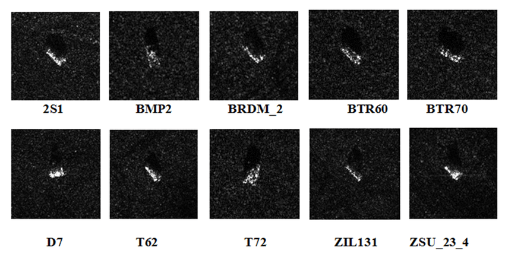

# How to add a new dataset into armory

This file presents two examples of how to add new datasets into armory-library.

## Torchvision

The [SAMPLE (Synthetic and Measured Paired Labeled Experiment) dataset](https://github.com/benjaminlewis-afrl/SAMPLE_dataset_public) consists of measured SAR imagery from the MSTAR collection (Moving and Stationary Target Acquisition and Recognition) paired with synthetic SAR imagery. 

The MSTAR dataset contains SAR imagery of 10 types of military vehicles illustrated in the figure below.



[Anas, H., Majdoulayne, H., Chaimae, A., & Nabil, S. M. (2020). Deep learning for sar image classification. In Intelligent Systems and Applications: Proceedings of the 2019 Intelligent Systems Conference (IntelliSys) Volume 1 (pp. 890-898). Springer International Publishing.](https://link.springer.com/chapter/10.1007/978-3-030-29516-5_67)

For a Torchvision dataset, we load the dataset using the `ImageFolder` dataset builder, which automatically infers the class labels based on the directory names.
```python
data_dir = sample_dir / Path("png_images", "qpm", "real")
raw_dataset = datasets.load_dataset('imagefolder', data_dir=data_dir)
```

Next, we define train, validation, and test splits.
```python
train_dataset = raw_dataset['train'].train_test_split(
    test_size=3/10,
    stratify_by_column='label'
)

test_dataset = train_dataset['test'].train_test_split(
    test_size=2/3,
    stratify_by_column='label'
)

mstar_dataset = datasets.DatasetDict(
    {
        'train': train_dataset['train'],
        'valid': test_dataset['train'],
        'test': test_dataset['test']
    }
)
```

Last, we integrate the dataset into Armory.
```python
batch_size = 16
shuffle = False

unnormalized_scale = armory.data.Scale(
    dtype=armory.data.DataType.UINT8,
    max=255,
)

mstar_dataloader = armory.dataset.ImageClassificationDataLoader(
    mstar_dataset['train'],
    dim=armory.data.ImageDimensions.CHW,
    scale=unnormalized_scale,
    image_key="image",
    label_key="label",
    batch_size=batch_size,
    shuffle=shuffle,
)

armory_dataset = armory.evaluation.Dataset(
    name="MSTAR-qpm-real",
    dataloader=mstar_dataloader,
)
```

## Hugging Face

To demonstrate a new Hugging Face dataset, we load the [VisDrone2019 dataset](https://github.com/VisDrone/VisDrone-Dataset) object detection dataset. The VisDrone2019 dataset, created by the AISKYEYE team at Tianjin University, China, includes 288 video clips and 10,209 images from various drones, providing a comprehensive benchmark with over 2.6 million manually annotated bounding boxes for objects like pedestrians and vehicles across diverse conditions and locations.

As a first step, we download the [validation split](https://drive.google.com/file/d/1bxK5zgLn0_L8x276eKkuYA_FzwCIjb59/view?usp=sharing) to a temporary directory. Note that we do not need to unzip the archive for processing as a Hugging Face dataset.
```python
tmp_dir = Path('/tmp')
visdrone_dir = tmp_dir / Path('visdrone_2019')
visdrone_dir.mkdir(exist_ok=True)

visdrone_val_zip = visdrone_dir / Path('VisDrone2019-DET-val.zip')
```
The VisDrone 2019 Task 1 dataset is organized as parallel folders of images and annotations containing pairs of image and annotation files, respectively. We then need to designate the object categories and name the fields in the annotation files.
```python
CATEGORIES = [
    'ignored',
    'pedestrian',
    'people',
    'bicycle',
    'car',
    'van',
    'truck',
    'tricycle',
    'awning-tricycle',
    'bus',
    'motor',
    'other'
]

ANNOTATION_FIELDS = [
    'x',
    'y',
    'width',
    'height',
    'score',
    'category_id',
    'truncation',
    'occlusion'
]
```

Next, we define the hierarchical features of the dataset by instantiating a [`datasets.Features`](https://huggingface.co/docs/datasets/v2.19.0/en/package_reference/main_classes#datasets.Features) object -- each feature is named and a Hugging Face data type provided.
```python
features = datasets.Features(
    {
        'image_id': datasets.Value('int64'),
        'file_name': datasets.Value('string'),
        'image': datasets.Image(),
        'objects': datasets.Sequence(
            {
                'id': datasets.Value('int64'),
                'bbox': datasets.Sequence(datasets.Value('float32'), length=4),
                'category': datasets.ClassLabel(num_classes=len(CATEGORIES), names=CATEGORIES),
                'truncation': datasets.Value('int32'),
                'occlusion': datasets.Value('int32'),
            }
        )
    }
)
```

We additionally need to define functions `load_annotations` and `generate_examples`. The `load_annotations` function takes a reader for an annotation file, parses an image description into a dictionary and returns the dictionary of image features. The `generate_examples` generator function uses the specified file reader to iterate over the image in dataset archive. For each image, the generator reads the image file bytes and parses
the associated annotation.

```python
def load_annotations(f: io.BufferedReader) -> List[Dict]:
    reader = csv.DictReader(io.StringIO(f.read().decode('utf-8')), fieldnames=ANNOTATION_FIELDS)
    annotations = []
    for idx, row in enumerate(reader):
        category_id = int(row['category_id'])
        annotation = {
            'id': idx,
            'bbox': list(map(float, [row[k] for k in ANNOTATION_FIELDS[:4]])),
            'category': category_id,
            'truncation': row['truncation'],
            'occlusion': row['occlusion']
        }
        annotations.append(annotation)
    return annotations

def generate_examples(files: Iterator[Tuple[str, io.BufferedReader]], annotation_file_ext:str ='.txt') -> Iterator[Dict[str, object]]:
    annotations = {}
    images = {}
    for path, f in files:
        file_name, _ = os.path.splitext(os.path.basename(path))
        if path.endswith(annotation_file_ext):
            annotation = load_annotations(f)
            annotations[file_name] = annotation
        else:
            images[file_name] = {'path': path, 'bytes': f.read()}
    for idx, (file_name, annotation) in enumerate(annotations.items()):
        example = {
            'image_id': idx,
            'file_name': file_name,
            'image': images[file_name],
            'objects': annotation,
        }
        yield example
```

We can now create the validation dataset by calling [`datasets.Dataset.from_generator`](https://huggingface.co/docs/datasets/v2.19.0/en/package_reference/main_classes#datasets.Dataset.from_generator) with the generator above.
```python
visdrone_val_files = datasets.DownloadManager().iter_archive(visdrone_val_zip)

visdrone_dataset = datasets.Dataset.from_generator(
    generate_examples,
    gen_kwargs={
    "files": visdrone_val_files,
    },
    features=features,
    
)
```
