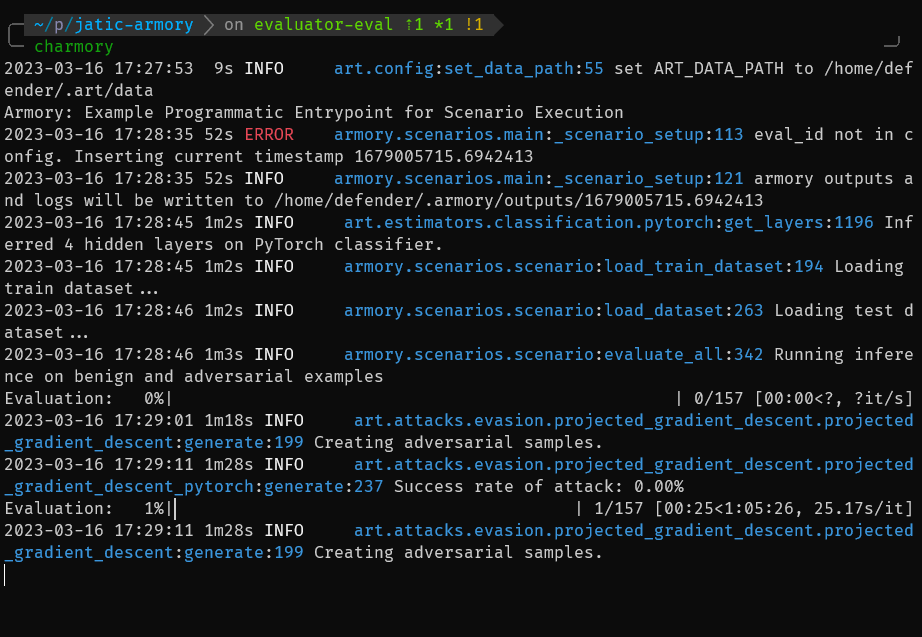

# TwoSix JATIC Sprint review 21 Mar 2023

  * most planned tasks were completed
     * mlflow tracking implemented #1887
     * docker dependencies removed #1889
     * twosix mlflow tracker authentication #1890 (won't do)
     * external code repositories discarded #1891
     * evaluation blocks become code #1892
     * refactor Evaluator #1894
   * not completed
     * demonstrate full scenario execution #1884 (partial)
     * document mlflow support #1888

---

# mlflow tracking implemented

  * track.py has sample code that shows parameter and result tracking
  * demonstrated tracking to localhost and cloud mlflow server

---

# docker dependencies and external code load removed

  * whole modules removed
  * no `docker` present in pyproject.toml
  * Evaluation.SysConfig has no `external_github_repo` and `docker_image` fields

---

# evaluation blocks become code

Example from charmory.blocks.mnist:

```python
dataset = Dataset(
    function="armory.data.datasets:mnist", framework="numpy", batch_size=128
)

model = Model(
    function="armory.baseline_models.keras.mnist:get_art_model",
    model_kwargs={},
    wrapper_kwargs={},
    weights_file=None,
    fit=True,
    fit_kwargs={"nb_epochs": 20},
)
```
---

# refactor evaluator

There were two classes in Armory vying for the title of "god object": Evaluator
and Scenario. It is hard to describe what they did because they did too much.
The Evaluator class has been discarded entirely after degenerating an
`__init__` and `run()` methods.

We are in the process of ripping the Scenario class apart.

---


# first look: charmory succeeds


---
